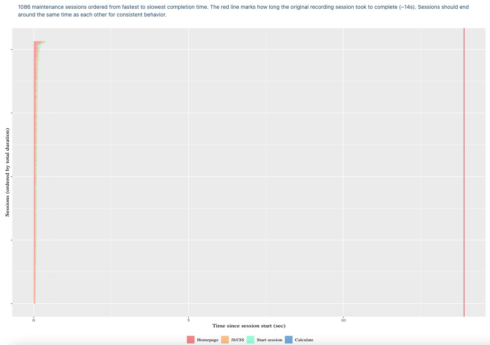

# Auditing Shiny apps

## Audit Shiny apps with {shinytest2}

Have you ever dreamed of profiling, load testing your Shiny app at each
commit, without having to manually run any script?

In this vignette, we’ll see how one can design and automate Shiny apps
audit pipelines with
[shinytest2](https://rstudio.github.io/shinytest2/).

### Introduction

This case study consists of analyzing a particularly non-optimized app,
whose code is defined below. This app simulates a stiff oscillator, also
known as Van der Pol
[model](https://en.wikipedia.org/wiki/Van_der_Pol_oscillator). Under the
hood, this system (composed of 2 differential equations) is integrated
with the [deSolve](http://desolve.r-forge.r-project.org/) package. Stiff
systems need a much smaller time step than classic systems, thereby
requiring more time to solve:

``` r
van_der_pol <- function(t, y, mu) {
  d_x <- y[2]
  d_y <- mu * (1 - y[1]^2) * y[2] - y[1]
  list(c(X = d_x, Y = d_y))
}

server <- function(input, output) {
  output$brussels <- renderPlot({
    y0 <- c(X = input$X, Y = input$Y)
    times <- seq(0, 1000, .01)
    out <- ode(y0, times, van_der_pol, input$mu)
    par(mfrow = c(1, 1))
    plot(out[, 2:3], type = "l", xlab = "X", ylab = "Y", main = "state diagram")
  })
}

ui <- fluidPage(
  headerPanel("Van der Pol oscillator"),
  sidebarLayout(
    sidebarPanel(
      h3("Init values"),
      numericInput("X", label = "X", min = 0.0, max = 5,  value = 1, step = 0.2),
      numericInput("Y", label = "Y", min = 0.0, max = 5,  value = 1, step = 0.2),

      h3("Parameters"),
      numericInput("mu", label = "mu", min = 0.0, max = 5,  value = 1, step = 0.1)
    ),
    mainPanel(
      h3("Simulation results"),
      plotOutput("brussels")
    )
  )
)

shinyApp(ui = ui, server = server)
```

As a first test, you can run the app by calling
`runApp(system.file("vig-apps/non-optimized-app/", package = "shinytest2"))`
locally and notice how slow it is to perform one computation. The next
question is, how does this app scale? The answer is likely “No it
doesn’t!”, but we would like to know exactly how bad it is. This is
where load testing comes to play.

### Load testing with {shinytest2}

Shiny app [load
testing](https://rstudio.github.io/shinyloadtest/index.html) aims at
running multiple identical user sessions in parallel and measure the
resulting app response. It answers many questions, such as:

- What is the time necessary to get to the homepage?
- How much time does it take to perform the first computation?
- Will all session end at the same time?

A load test is composed a three phases:

- Similarly to [shinytest2](https://rstudio.github.io/shinytest2/),
  [shinyloadtest](https://rstudio.github.io/shinyloadtest/) records a
  user session with `shinyloadtest::record_session()`.
- This session is subsequently replayed by a Java-based tool,
  `shinycannon`, able to simulate multiple sessions during a chosen
  amount of time.
- Sessions are analyzed by `shinyloadtest::load_runs()` and an HTML
  report generated with `shinyloadtest::shinyloadtest_report()`.

In general, the first step is done manually, that is, you play with the
app as if you were a real business user and stop the session when
satisfied. However, because of
[shinytest2](https://rstudio.github.io/shinytest2/) headless
capabilities, we could manipulate the app with
[shinytest2](https://rstudio.github.io/shinytest2/) helpers such as
`set_inputs` or raw JavaScript code to achieve the same goal.

There is, however, a tiny technical obstacle to overcome. By default,
[shinytest2](https://rstudio.github.io/shinytest2/) starts the app on a
given port and the headless browser, namely Chrome, is then connected to
the same port. This would be an issue with
[shinyloadtest](https://rstudio.github.io/shinyloadtest/) since the
recorder does not listen to the same port, which is `8600`. In practice,
we’ll have to:

- Start the Shiny app as a background process on a given port.
- Fire the load test recorder on port `8600`.
- Connect Chrome to the recorder on port `8600`.

#### Launch the background app

You may have already noticed that when launching a Shiny app, you can’t
run anything else in the R console while the app is live. The
explanation is pretty simple: R performs tasks sequentially and can only
perform one calculation at a time.

How do we start the app without blocking the main R process? We leverage
the [callr](https://callr.r-lib.org) package, which exposes a convenient
API to start R processes in the background, that is, without blocking
the main R process. The code below shows how to start a Shiny app
located at `path` on a specific port and run the load test recorder on
the same port:

``` r
# Main shiny app
shiny_bg <- function(path, port) {
  options(shiny.port = port)
  shiny::runApp(path)
}

# Start recorder
recorder_bg <- function(port) {
  shinyloadtest::record_session(
    target_app_url = sprintf("http://127.0.0.1:%s", port),
    host = "127.0.0.1",
    port = 8600,
    output_file = "recording.log",
    open_browser = FALSE
  )
}
```

We can pass this to the `start_r_bg()` function:

``` r
start_r_bg <- function(fun, path = NULL, port = 3515) {

  # remove NULL elements
  args <- Filter(Negate(is.null), list(path = path, port = port))

  process <- callr::r_bg(
    func = fun,
    args = args,
    stderr= "",
    stdout = ""
  )

  while (any(is.na(pingr::ping_port("127.0.0.1", 3515)))) {
    message("Waiting for Shiny app to start...")
    Sys.sleep(0.1)
  }

  attempt::stop_if_not(
    process$is_alive(),
    msg = "Unable to launch the subprocess"
  )

  process
}
```

where `r_bg()` starts a background R process, passing the corresponding
function and parameters. Besides, we provide some log elements and
safety guard in case the app can’t start. To launch the app and recorder
we can call:

``` r
target <- start_r_bg(shiny_bg, path = system.file("vig-apps/non-optimized-app/", package = "shinytest2"))
# Listening on 127.0.0.1:3515
recorder <- start_r_bg(recorder_bg)
# Listening on 127.0.0.1:8600
```

#### Connect Chrome

The previous part was the most technical step. Now, we only have to
start a Chrome headless browser on port `8600`, where the load test
recorder runs. You’ll notice that
[shinytest2](https://rstudio.github.io/shinytest2/) also supports remote
urls. We should increase the value of `load_timout` to 15 seconds to
help us avoid producing this annoying
[shinytest2](https://rstudio.github.io/shinytest2/) warning:

    {shinytest2} R  info 15:25:37.36 Error while initializing AppDriver:
    Shiny app did not become stable in 10000ms.

``` r
# Start AppDriver with recorder url
chrome <- shinytest2::AppDriver$new("http://127.0.0.1:8600", load_timeout = 15 * 1000)
```

If your running under Linux OS, below shows the list of R processes
running so far in the background:

    $ netstat -lntp

    Proto Recv-Q Send-Q Local Address           Foreign Address         State       PID/Program name
    tcp        0      0 127.0.0.1:8600          0.0.0.0:*               LISTEN      361115/R
    tcp        0      0 127.0.0.1:3515          0.0.0.0:*               LISTEN      361101/R
    tcp        0      0 127.0.0.1:44179         0.0.0.0:*               LISTEN      359555/google-chrom

If everything is successful, you should see a **Client connected**
message in the R console. We then change the `mu` parameter input
without forgetting the timeout:

``` r
app$set_inputs(mu = 4, timeout_ = 15 * 1000)
```

We can inspect the logs with the help of `chrome$get_log()`, to check
whether everything run smoothly:

    app$get_logs()
    #> {shinytest2} R  info 14:27:00.80 Start AppDriver initialization
    #> {shinytest2} R  info 14:27:00.82 Creating new ChromoteSession
    #> {shinytest2} R  info 14:27:02.20 Navigating to Shiny app
    #> {shinytest2} R  info 14:27:02.57 Injecting shiny-tracer.js
    #> {chromote}   JS info 14:27:02.61 shinytest2; jQuery not found
    #> {chromote}   JS info 14:27:02.63 shinytest2; Loaded
    #> {shinytest2} R  info 14:27:02.64 Waiting for Shiny to become ready
    #> {chromote}   JS info 14:27:02.72 shinytest2; jQuery found
    #> {chromote}   JS info 14:27:02.73 shinytest2; Waiting for shiny session to connect
    #> {chromote}   JS info 14:27:03.12 shinytest2; Connected
    #> {shinytest2} R  info 14:27:03.17 Waiting for Shiny to become idle for 200ms within 10000ms
    #> {chromote}   JS info 14:27:03.18 shinytest2; Waiting for Shiny to be stable
    #> {chromote}   JS info 14:27:03.27 shinytest2; shiny:busy
    #> {chromote}   JS info 14:27:06.28 shinytest2; shiny:idle
    #> {chromote}   JS info 14:27:06.30 shinytest2; shiny:value brussels
    #> {chromote}   JS info 14:27:06.48 shinytest2; Shiny has been idle for 200ms
    #> {shinytest2} R  info 14:27:06.48 Shiny app started
    #> {shinytest2} R  info 14:30:17.79 Setting inputs: 'mu'', ''X'', ''Y'
    #> {chromote}   JS info 14:30:17.81 shinytest2; inputQueue: adding mu
    #> {chromote}   JS info 14:30:17.81 shinytest2; inputQueue: adding X
    #> {chromote}   JS info 14:30:17.81 shinytest2; inputQueue: adding Y
    #> {chromote}   JS info 14:30:17.82 shinytest2; inputQueue: flushing mu
    #> {chromote}   JS info 14:30:17.83 shinytest2; inputQueue: flushing X
    #> {chromote}   JS info 14:30:17.83 shinytest2; inputQueue: flushing Y
    #> {chromote}   JS info 14:30:17.87 shinytest2; shiny:busy
    #> {chromote}   JS info 14:30:20.42 shinytest2; shiny:idle
    #> {chromote}   JS info 14:30:20.46 shinytest2; shiny:value brussels
    #> {shinytest2} R  info 14:30:20.47 Finished setting inputs. Timedout: FALSE

Once satisfied, we may close the headless connection to stop the
recorder:

``` r
# clean
app$stop()
# needed to avoid
# java.lang.IllegalStateException: last event in log not a
# WS_CLOSE (did you close the tab after recording?)
Sys.sleep(2)
```

#### Replay with shinycannon

If you remember, the final step consists of replaying the main session
in parallel. We start `shinycannon` with 5 workers and wait:

``` r
target_url <- "http://127.0.0.1:3515"
workers <- 5
system(
  sprintf(
    "shinycannon recording.log %s --workers %s --loaded-duration-minutes 2 --output-dir run1",
    target_url, workers
  )
)

# shinycannon replay
#2022-05-09 14:37:18.549 INFO [thread00] - Detected target application type: R/Shiny
#2022-05-09 14:37:18.560 INFO [thread00] - Waiting for warmup to complete
#2022-05-09 14:37:18.554 INFO [thread01] - Warming up
#2022-05-09 14:37:18.562 INFO [progress] - Running: 0, Failed: 0, Done: 0
#2022-05-09 14:37:23.563 INFO [progress] - Running: 1, Failed: 0, Done: 0
```

Some error message in the `shinycannon` logs can be explained by
failures during the [shinytest2](https://rstudio.github.io/shinytest2/)
driver initialization. If this error persist, best practice is to
restart R, cleanup everything and start again.

#### Report generation

The report generation is quite straightforward:

``` r
# Close the running app
target$kill()

# Treat data and generate report
df <- shinyloadtest::load_runs("run1")
shinyloadtest::shinyloadtest_report(
  df,
  "public/index.html",
  self_contained = TRUE,
  open_browser = FALSE
)
```

We don’t forget to clean the target app so as to kill the underlying
process. Note that if you want to deploy the report on GitHub Pages, you
have to name it `index.html`.

#### Automating with GitHub Actions

Now, it is time to integrate the current pipeline in a CI/CD workflow.
For convenience, we wrap all the previous steps in a single function:

``` r
## File: R/audit-app.R
record_loadtest <- function(path, timeout = 15, workers = 5) {
  message("\n---- BEGIN LOAD-TEST ---- \n")
  # start app + recorder
  target <- start_r_bg(shiny_bg, path = path)
  recorder <- start_r_bg(recorder_bg)

  # start headless chrome (points to recorder!).
  # AppDriver also support remote urls.
  app <- shinytest2::AppDriver$new(
    "http://127.0.0.1:8600",
    load_timeout = timeout * 1000
  )

  app$set_inputs(mu = 4, timeout_ = timeout * 1000)

  # clean
  app$stop()
  # needed to avoid
  # java.lang.IllegalStateException: last event in log not a
  # WS_CLOSE (did you close the tab after recording?)
  Sys.sleep(2)

  # shinycannon (maybe expose other params later ...)
  target_url <- "http://127.0.0.1:3515"
  system(
    sprintf(
      "shinycannon recording.log %s --workers %s --loaded-duration-minutes 2 --output-dir run1",
      target_url, workers
    )
  )

  target$kill()

  # Treat data and generate report
  df <- shinyloadtest::load_runs("run1")
  shinyloadtest::shinyloadtest_report(
    df,
    "public/index.html",
    self_contained = TRUE,
    open_browser = FALSE
  )
}
```

Below is the necessary GitHub Actions yaml file. Overall, this will:

- Run each time code is pushed to GitHub.
- Run in parallel on 3 different Ubuntu flavors.
- Install R, some system dependencies, and R packages. Install
  shinycannon tools for load-testing.
- Deploy the load test report to GitHub Pages.

``` yaml
on:
  push:
    branches: [main, master]
  pull_request:
    branches: [main, master]

name: shiny-loadtest-ci

jobs:
  shiny-loadtest-ci:
    runs-on: ${{ matrix.config.os }}
    permissions:
      contents: write

    name: ${{ matrix.config.os }} (${{ matrix.config.r }})

    strategy:
      fail-fast: false
      matrix:
        config:
          - {os: ubuntu-latest,   r: 'devel', http-user-agent: 'release'}
          - {os: ubuntu-latest,   r: 'release'}
          - {os: ubuntu-latest,   r: 'oldrel-1'}

    env:
      GITHUB_PAT: ${{ secrets.GITHUB_TOKEN }}
      R_KEEP_PKG_SOURCE: yes

    steps:
      - uses: actions/checkout@v2
      - uses: r-lib/actions/setup-r@v2
      - uses: r-lib/actions/setup-r-dependencies@v2
        with:
          cache-version: 2
          extra-packages: |
            any::shinyloadtest
            any::lubridate
            any::DT
            any::callr
            any::shinytest2
            any::deSolve
            any::attempt

      - name: Install shinycannon 💥
        run: |
          sudo bash -c 'apt-get update; apt-get install -y default-jre-headless; apt-get clean; rm -rf /var/lib/apt/lists/*'
          wget https://github.com/rstudio/shinycannon/releases/download/v1.1.3/shinycannon_1.1.3-dd43f6b_amd64.deb
          sudo dpkg -i ./*.deb

      - name: Run load test 🏥
        shell: Rscript {0}
        run: |
            source("R/audit-app.R")
            record_loadtest(path = "app.R");

      - name: Deploy to GitHub pages 🚀
        if: github.event_name != 'pull_request'
        uses: JamesIves/github-pages-deploy-action@4.1.4
        with:
          clean: false
          branch: gh-pages
          folder: public
```

If you want to test it on your end, below are lines of code to setup a
RStudio project and link it to GitHub:

``` r
# Inside the project
# Use audit GitHub Actions workflow
usethis::use_github_action(url = "https://raw.githubusercontent.com/rstudio/shinytest2/main/inst/gha/app-audit.yaml")
# Copy audit script
dir.create("R", showWarnings = FALSE)
file.copy(system.file("gha/audit-app.R", package = "shinytest2"), "R/audit-app.R")
# Create your app.R file
file.create("app.R")

message("TODO: User - Copy in your app code to `app.R`!")

# To test it locally
source("R/audit-app.R")
record_loadtest("app.R")

# Test the audit with GitHub Actions
usethis::use_description()
usethis::use_git()
usethis::use_github()
usethis::use_github_pages()
```

If you test it locally within a package, you may want to ignore
`public`, `recording.log` by adding them in the `.Rbuildignore` file,
which will avoid unnecessary warnings during any future
`devtools::check()`:

``` r
usethis::use_build_ignore(c("public", "recording.log"))
```

An example is available
[here](https://github.com/DivadNojnarg/shinyAuditTest).


As shown in the above report, especially in the session duration tab,
the app is clearly not able to handle 5 simultaneous user due to the
very large computations being performed by the Shiny server:

- The red area is over represented for most sessions, which means many
  users have to wait significant amount of time before seeing the app.
  This is a critical issue, most users will leave the app at this
  moment.
- The blue area is also large, showing that most time is spent for
  computations. Given the single-threaded nature of R, there are high
  chances other users might be blocked by already ongoing computations.
  This is also frustrating, as people may think the app has crashed.

Even though out of this vignette scope, one quick and significant
optimization would be to set a caching
[system](https://shiny.rstudio.com/articles/caching.html) with
`shiny::bind_cache()`. As shown in the following figure, adding cache is
so fast that `shinycannon` was able to start more than 1000 sessions in
2 minutes.


