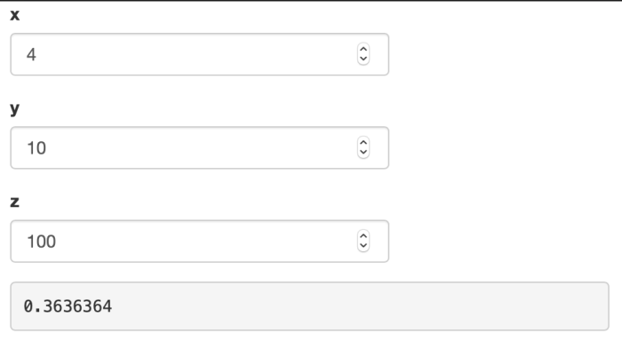

```{r setup, include=FALSE}
knitr::opts_chunk$set(echo = TRUE, eval = FALSE)
```

## Customizing test scripts

The test recorder is the easiest way to create test scripts, but it is not the only way. You can create and edit test scripts manually.

The final product would look something like:

```r
# File: ./tests/testthat/test-shinytest2.R
test_that("App initialization is consistent", {
  app <- AppDriver$new()

  app$expect_values()
})
```


A test script has this basic structure: first, there is an initialization, then the expectations are performed.

In the initialization, the script creates a new `AppDriver` object.

```{r}
app <- AppDriver$new()
```

Next, define some interactions with the application and makes expectations via snapshots.

```{r}
app$set_inputs(check_group = c("1", "2"))
app$set_inputs(check_group = c("1", "2", "3"))
app$click("action")
app$expect_values()

app$click("action")
app$expect_values()
```

For customizing a script, the second portion -- the interactions and expectations -- is the part you will want to modify.

### Setting inputs with `app$set_inputs()` and `app$click()`

With `app$set_inputs()`, you provide the name of one or more inputs and corresponding values to set them to. Consider this set of directives:

```{r}
app$set_inputs(check_group = c("1", "2"))
app$set_inputs(check_group = c("1", "2", "3"))
app$click("action")
```

Notice that we set the value of `check_group` two times in a row. When we recorded this test script, it started with the value `"1"`, and then we checked the `"2"` and `"3"` boxes. The recorded script set the value to `c("1", "2")`, and then ` c("1", "2", "3")`. The `c("1", "2")` value was simply an intermediate step.

It is possible to simplify and speed up the tests by dropping the intermediate step, which leaves us with this:

```{r}
app$set_inputs(check_group = c("1", "2", "3"))
app$click("action")
```

Multiple calls to `app$set_inputs()` should be reduced to a single line unless the side effects of setting inputs multiple times is desired. When `app$set_inputs()` is called, it normally returns control and moves on to the next step only after the server sends a response to the client. The reason it waits for a response is so that a subsequent call to `app$snapshot()` will be sure to capture the updated output values. If `app$set_inputs()` did not wait for a update, then, if the output update did not happen very quickly, a snapshot might capture the state of the application before the outputs are updated.


### Making expectations

For an in-depth discussion of expectations, see the [Robust testing vignette](./robust.html).

There are a couple standard ways to make expectations from your `AppDriver` object.

* `app$expect_values()`: This is the simplest way to make an expectation. It creates a list of values and compares them to the current values of the application. It also takes a debug screenshot and stores it as a snapshot. However, this snapshot will never fail an expectation test. The extra screenshot file is useful for manually determining if UI changes have happened over time while not producing numerous false-positive test failures.

* `app$expect_screenshot()`: This method takes a screenshot of the application and compares it to a reference screenshot. If the screenshots are different, it fails the test.

There are few ways to use `app$expect_values()`. The simplest way is to call it with no arguments:

```{r}
app$expect_values()
```

The first time this is called in a test script, it will record all `input`, `output`, and `export` values from the application, in a file called `001.json`. The next call will save the values in `002.json`, and so on.

Each time you call `app$expect_values()`, it will also save a debug screenshot of the web browser, in a file `001_.png`, `002_.png`, and so on. These screen shots are useful for debugging your tests and inspecting what they're doing. You can tell it to not take screen shots, to save space and make the tests run slightly faster, in the initialization step, with:

```{r}
app <- AppDriver$new(expect_values_screenshot_args = FALSE)
```

If you want to disable screenshots for a single `app$expect_values()` call, you can use:

```{r}
app$expect_values(screenshot_args = FALSE)
```

If you want more targeted tests, you can snapshot specific items by using the `input`, `output`, and `export` parameters. For example, to capture the value of just the outputs named `"a"` and `"b"`, you would call:

```{r}
app$expect_values(output = c("a", "b"))
```

You could also capture specific inputs or exports:

```{r}
app$expect_values(
  input = "n",
  output = c("a", "b"),
  export = c("e1", "e2")
)
```

Finally, if you want to snapshot all `output`s but no inputs or exports, you can simply set `output` to `TRUE` as only values that are requested are recorded:

```{r}
app$expect_values(output = TRUE)
```

The same can be used to snapshot all `input` and/or all `export` values. To capture all `output` and `export` values, but no `input` values:

```{r}
app$expect_values(output = TRUE, export = TRUE)
```


### Exported values

In some cases, it's useful to snapshot some bits of internal state of an application -- state that's not reflected directly in the inputs or outputs. This can be done by *export*ing values.

Consider this toy example where an application has an internal reactive expression that would be convenient to capture.

```{r}
shinyApp(
  fluidPage(
    numericInput("x", "x", 4),
    numericInput("y", "y", 10),
    numericInput("z", "z", 100),
    verbatimTextOutput("result", placeholder = TRUE)
  ),
  function(input, output, session) {
    xy <- reactive(input$x * input$y)
    yz <- reactive(input$y + input$z)

    output$result <- renderText({
      xy() / yz()
    })

    exportTestValues(
      xy = {
        xy()
      },
      yz = {
        yz()
      }
    )
  }
)
```

```{r echo=FALSE, eval=TRUE, out.width='100%', fig.align='center'}

```

Notice these lines:

```{r}
    exportTestValues(
      xy = {
        xy()
      },
      yz = {
        yz()
      }
    )
```

This creates exported values called `xy` and `yz`. When a test snapshot is taken, it evaluates the reactive expression and inserts their values in the snapshot:

```json
{
  "input": {
    "x": 4,
    "y": 10,
    "z": 100
  },
  "output": {
    "result": "0.3636364"
  },
  "export": {
    "xy": 40,
    "yz": 110
  }
}
```

Note that the expression (i.e. `xy()` and `yz()`) is saved when `exportTestValues()` is called, not the specific values. Generally, you should keep these expressions as simple as possible so that test failures yield informative outputs. Note that any value here has to be serializable to JSON, so it's not suitable for testing complex objects.

### Adding delays

In some cases, you may need to wait for some amount of time between steps (e.g. waiting for CSS animations). You can do this by adding `Sys.sleep()` in your script. For example:

```{r}
Sys.sleep(0.5)
```

However, if you are waiting for some Shiny reactives to be calculated, please read more in the [Waiting for an `output` (or `input`) value](#wait-for-value) section.


### Controlling random values {#controlling-random-values}

If your application uses randomly-generated values (by calling functions like `rnorm`, `runif`, `sample` directly or indirectly), then, in normal operation, it will produce different results on each run. Because `{shinytest2}` works by comparing the current state of an application to a previous state, these random changes will cause test failures.

To make such applications exactly repeatable, you can set the random seed. This can be done by specifying a random seed in the recorder. The seed can be any integer value.

```{r echo=FALSE, eval=TRUE, out.width='100%', fig.align='center'}

```

If your test script has already been created, you can set the random seed by editing the test script so that the `AppDriver$new()` call has a value for `seed`. Moreover, if you need these tests to pass on multiple versions of R with different `RNGkind()` defaults (e.g., 3.5 and 3.6), you may want to set a fixed `RNGkind()` across your tests (perhaps via `RNGversion("3.5.0")`). However, using a `AppDriver$new(variant=)` value that contains the R version can also remedy this situation.

```{r}
app <- AppDriver$new(seed = 4323)
```

In many cases, instead of setting the random seed, it is more elegant to use an [output preprocessor](zzz-faq.html#can-i-modify-the-input-and-output-values-that-are-recorded-in-snapshots).


## Widgets

### Tabs

With tabbed views, such as `tabsetPanel()` and `navbarPage()`, in order for `{shinytest2}` to keep track of which tab is currently selected, they must have an `id`. For example:


```{r}
tabsetPanel(id = "tabs", ....)
```

or

```{r}
navbarPage(id = "tabs", ....)
```

### Uploading files

If you record a file upload event to a `fileInput`, the test script will have a line like this:

```{r}
app$uploadFile(file1 = "mtcars.csv")
```

Notice that the filename `"mtcars.csv"` appears in the script without a full file path. This is because the test recorder does not know where the file came from; it only knows the name of the file.

Before you run the test script, you must copy the file to the `tests/testthat/` directory.  See the `tests/testthat/` subdirectory of [this app](https://github.com/rstudio/shinytest2/tree/61d51d9e96640bfae3eeefa12c4b685099b584c8/tests/testthat/apps/upload) for an example.

After copying the file to that directory, run `test_app()` as usual.


### View the headless browser

As you step through the script, you can inspect the state of the application in a few different ways.

The recommended way is to call `app$view()`. This will open a browser window in your default Chrome browser.

Another way is to take a screenshot of your application. You can call `app$get_screenshot()` to take a screenshot of the application. This will display the screenshot as if it were a plot. (In RStudio, it will show in the Plots tab.)

Using both methods, you can inspect the screenshot to see the state of the application.


### Getting input, output, and export values

It can also be useful to get the current input, output, and export values.

To fetch all values without incrementing the expectation counter, you can call `app$get_values()`. This returns a list, which you can inspect with the `str()` function. It may look something like this:

```{r}
vals <- app$get_values()

str(vals)
#> List of 3
#>  $ input :List of 4
#>   ..$ action    :Classes 'integer', 'shinyActionButtonValue'  int 0
#>   ..$ checkbox  : logi TRUE
#>   ..$ check_group: chr "1"
#>   ..$ text      : chr "Enter text..."
#>  $ output:List of 12
#>   ..$ action_out    : chr "[1] 0\nattr(,\"class\")\n[1] \"integer\"                #> \"shinyActionButtonValue\""
#>   ..$ checkbox_out  : chr "[1] TRUE"
#>   ..$ check_group_out: chr "[1] \"1\""
#>   ..$ text_out      : chr "[1] \"Enter text...\""
#>  $ export: Named list()
```

The values retrieved this way can be used for expectation-based testing. For example, we could retrieve the `checkbox_out` value and compare it to a known string:

```{r}
vals <- app$get_values()
expect_identical(vals$output$checkbox_out, "[1] TRUE")

# Or in a single line:
expect_identical(app$get_value(output = "checkbox_out"), "[1] TRUE")
```

### Waiting for an `input` (or `output`) value {#wait-for-value}

In most situations, when an `input` value is set, `app$set_inputs()` will wait up to 3 seconds (default) for the next output value to be sent from the server.  If, however, you have an application that does not immediately send the value you are interested in, you will need to insert at `app$wait_for_value()` function call.  This is readily useful for htmlwidgets or anything that involves javascript code to set `input` values. This method can also be used to determine when `input` (or `output`) values have been set after the initial output values have been set or for when reactivity is done in two or more stages.

For example, when checking a checkbox that adds dynamic UI, such as the old faithful Shiny example, three round trips from the browser to the Shiny server will need to occur.

1. Checking the checkbox
2. Putting the slider and plot placeholder into the app's UI
3. Once the slider is recognized by the browser, it will send information back to Shiny causing the plot to be rendered and placed in the browser

If we were to only use `app$set_inputs("chkbx", TRUE)` and immediately take a snapshot, we would most likely miss the correct plot value.

To dig into this further, we can look at this situation's example code:

**`app.R`:**
```r
library(shiny)

ui <- fluidPage(
  checkboxInput("chkbx", "Display Graph?", FALSE),
  uiOutput("dynamic_output")
)

server <- function(input, output) {
  output$dynamic_output <- renderUI({
    if(!input$chkbx) {
      return(NULL)
    }
    tagList(
      sliderInput(inputId = "bins", label = "Number of bins:", min = 1, max = 50, value = 30),
      plotOutput(outputId = "dist_plot")
    )
  })

  # Will not execute until `input$bins` is available
  # `input$bins` is not available until `chkbx` is checked
  output$dist_plot <- renderPlot({
    # artificially slow the plot
    Sys.sleep(5)

    x    <- faithful$waiting
    bins <- seq(min(x), max(x), length.out = input$bins + 1)
    hist(x, breaks = bins, col = "#75AADB", border = "white",
         xlab = "Waiting time to next eruption (in mins)",
         main = "Histogram of waiting times")
  })
}
shinyApp(ui = ui, server = server)
```

Naively, we could add `Sys.sleep()` function calls to slow down `{shinytest2}` testing to hope that the Shiny application is in a stable state.

**`./tests/testthat/test-use-sleep-bad.R`:**
```r
test_that("Sleeping can work to wait for an app to stabilize", {
  app <- AppDriver$new()

  # Check the box to display the slider and plot
  app$set_inputs('chkbx' = TRUE)
  # Hope that the plot appears within 7 seconds
  Sys.sleep(7)

  app$snapshot()

  app$set_inputs(bins = 40)
  # Hope the newer plot appears within 7 seconds
  Sys.sleep(7)

  app$expect_values()
})
```

The above pattern will probably fail if executed on a slower machine. This pattern of _sleeping and hoping_ should be replaced with `app$wait_for_idle()` or `app$wait_for_value()`. `app$wait_for_idle()` will wait for the whole application to be idle for 500ms (default). This method is more intuitive, generic, and is easier to code. `app$wait_for_value()` will wait for a specific input value to not be an `ignore`ed value. This method is very specific and requires more logic to code.


**`./tests/testthat/test-wait-good.R`:**
```r
test_that("Use $wait_for_idle() for app to stabilize", {
  app <- AppDriver$new()

  # Check the box to display the slider and plot
  app$set_inputs(chkbx = TRUE)

  # Wait until Shiny is not busy for 500ms
  app$wait_for_idle(500)

  # Make expectation
  app$expect_values()

  # Change slider value to 40
  app$set_inputs(bins = 40, wait_ = FALSE)
  # Wait until Shiny is not busy for 500ms
  app$wait_for_idle(500)

  # Make expectation
  app$expect_values()
})

test_that("Use $wait_for_value() for app to stabilize", {
  app <- AppDriver$new()

  # Check the box to display the slider and plot
  app$set_inputs(chkbx = TRUE)

  # Wait until `output$dist_plot` is not `NULL`
  # (Store the retrieved plot value for later comparison)
  first_plot_value <- app$wait_for_value(output = "dist_plot", ignore = list(NULL))

  # Make expectation
  app$expect_values()

  # Change slider value to 40
  app$set_inputs(bins = 40, wait_ = FALSE)
  # Wait until plot does not equal the plot with 30 bins
  app$wait_for_value(output = "dist_plot", ignore = list(first_plot_value))

  app$expect_values()
})
```

## Dealing with dynamic data

If your application uses a data source that changes over time, then a snapshot taken yesterday may not match a snapshot taken today, even if the app itself hasn't changed. Dynamic data inherently poses a challenge for snapshot-based testing.

This problem can be avoided by detecting when the application is being tested, and in that case use a static data set instead. To do the detection, you can do something like the following:

```{r}
if (isTRUE(getOption("shiny.testmode"))) {
  # Load static/dummy data here
} else {
  # Load normal dynamic data here
}
```

## Using `variant` to expect different snapshots

You can variants to deal with cases where the snapshot output varies and you want to capture and test the variations. Common use cases include variations for operating system, R version, or version of key dependency. Variants are an advanced feature.

When you use them, you'll need to carefully think about your testing strategy to ensure that all important variants are covered by automated tests, and ensure that you have a way to get snapshot changes out of your CI system and back into the repo.

It is recommended to use `AppDriver$new(variant= platform_variant())` to capture the operating system and R version where the test is running. Variants are required when calling `$expect_screenshot()`. A `NULL` value may be used, but is not recommended for testing reproducibility.

All `{shinytest2}` expectation methods eventually call [`testthat::expect_snapshot_file()`](https://testthat.r-lib.org/reference/expect_snapshot_file.html) to save the snapshot files. Snapshot expectations will only compare to their variant's version of the snapshot file.

## Limitations

### Inputs without input bindings

Most input components in Shiny set their values by communicating through something called an *input binding*. `{shinytest2}` works well with `input` values that are set via input bindings.

However, there are some components that set input values without using an input binding. These include some [htmlwidgets](http://www.htmlwidgets.org/), such as [DT](https://rstudio.github.io/DT/) and [plotly](https://github.com/plotly/plotly.R), as well as Shiny's built-in plot interactions with `renderPlot()`.

To set these unbound inputs, the resulting test script code will look something like this:

```{r}
app$set_inputs(table_rows_selected = 1, allow_no_input_binding_ = TRUE)
app$set_inputs(table_row_last_clicked = 1, allow_no_input_binding_ = TRUE)
```

When the test script is replayed, the headless browser will set these inputs to the specified values and send them to the server running Shiny in R. However, the browser will not be able to tell the input object to do the exact same behaviors. For example, with DT, when a row is selected, the mouse click event in the browser triggers the DataTable to highlight the row in the browser and also set the input value for Shiny. When `{shinytest2}` plays the script, it can only do the latter part, setting the input value. The result is that when a screenshot is taken, it **will not** have highlighted rows. For components that have internal state that is updated in response to user interaction, that internal state will not be updated when the test script is played. In some cases, this may mean that when the script is played, the behavior when the script is played will not be the same as when a user actually interacts with the application.

If the input component sets multiple input values (without bindings) in response to a single user event, it may make sense to coalesce them into a single `set_inputs` call, such as this:

```{r}
app$set_inputs(
  table_rows_selected = 1,
  table_row_last_clicked = 1,
  allow_no_input_binding_ = TRUE
)
```

### Input component(s) provided as variable(s)

In some cases there might be a need to provide the input components using the variables (not hard-coded). It's possible as `$set_inputs()` uses `rlang::list2(...)` to process the input values. This function supports `!!!`, [the splicing operator](https://rlang.r-lib.org/reference/splice.html), so one can construct a list outside of set_inputs() and use it to set the input values.

```{r}

# helper function that wraps `set_inputs`, with  the default value for the 'dataset' component
update_dataset <- function(app, value, component_id = "dataset") {
  
  checkmate::assert_choice(value, c("rock", "pressure", "cars"))
  ml <- rlang::list2()
  ml[[component_id]] <- value
  app$set_inputs(!!!ml)
}

appDir <- system.file("examples/02_text", package = "shiny")
app <- shinytest2::AppDriver$new(appDir)
update_dataset(app, "rock")

```

## Next

Learn about using shinytest2 with [continuous integration](use-ci.html).
