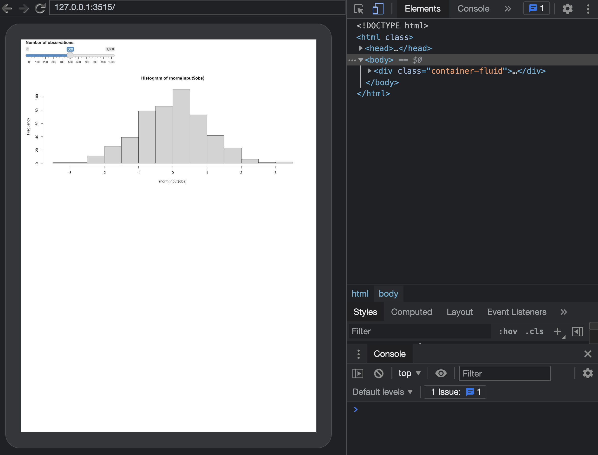
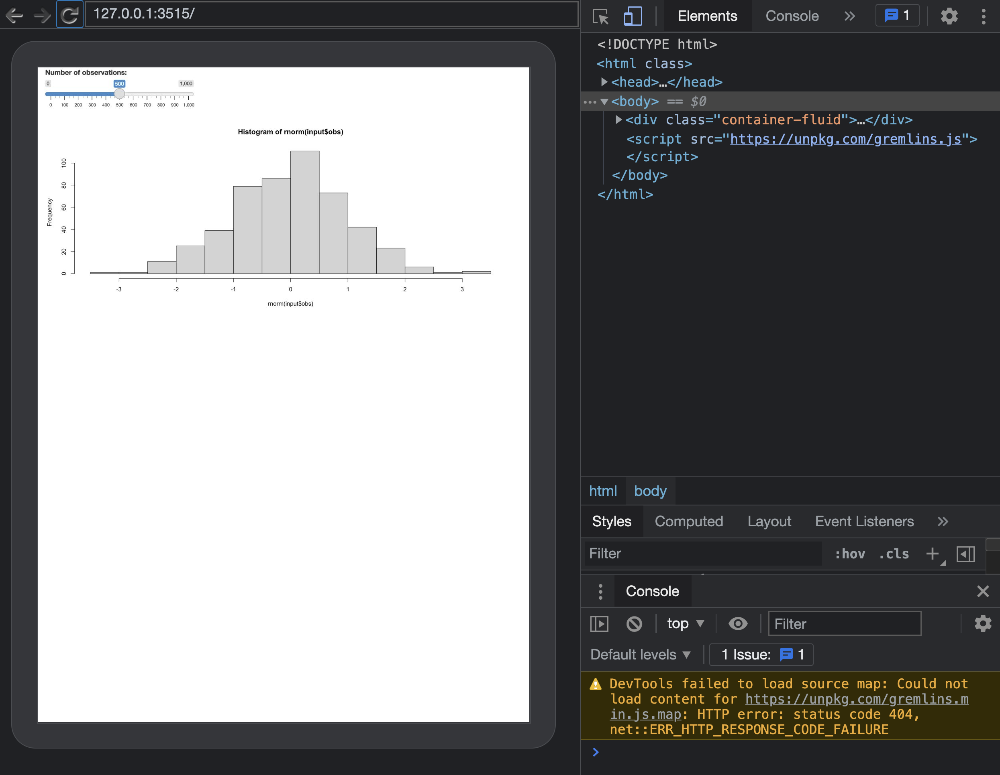
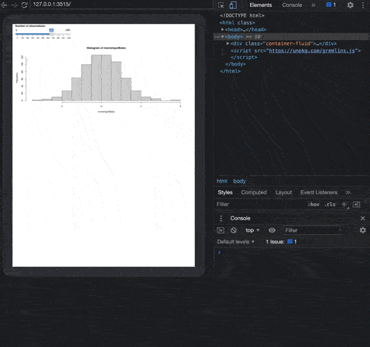
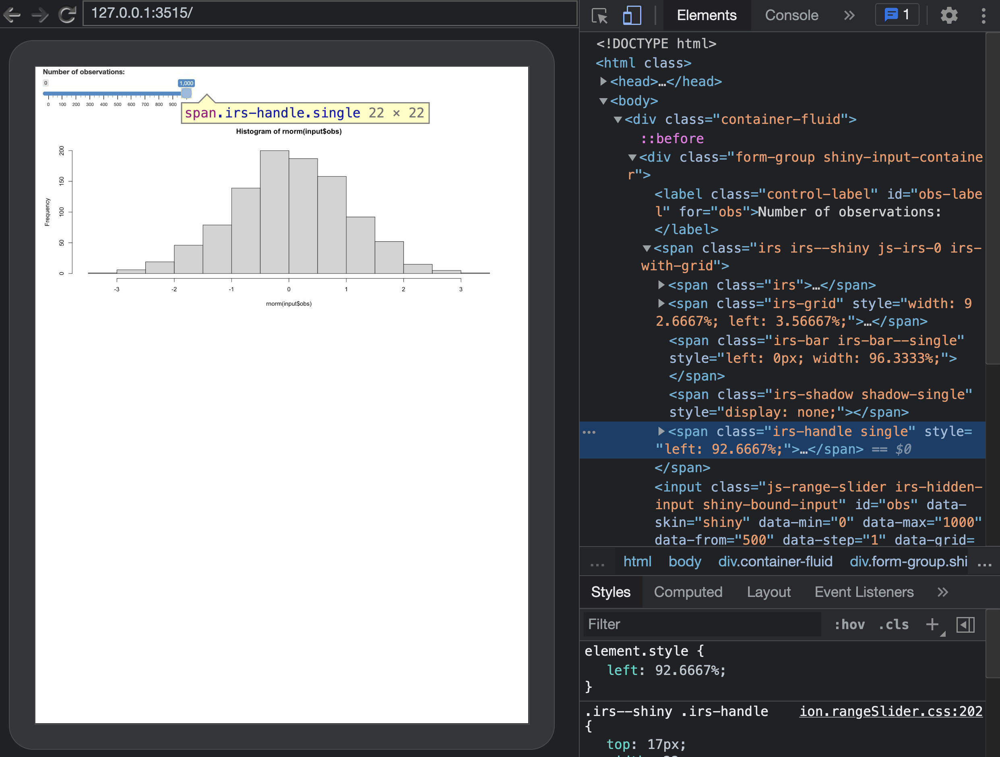
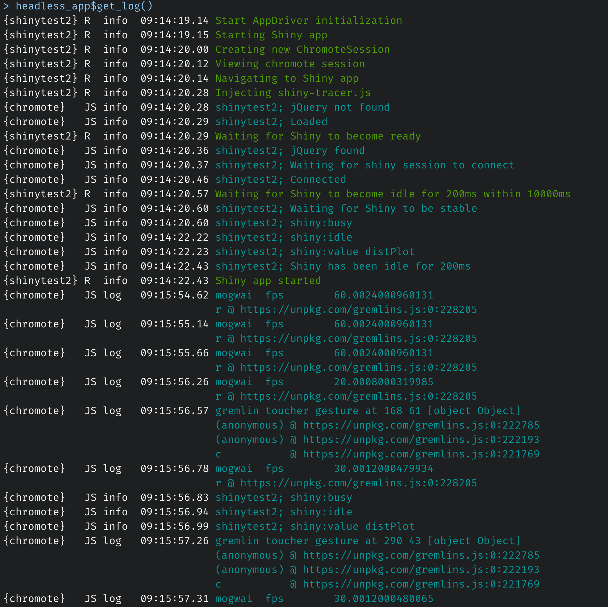
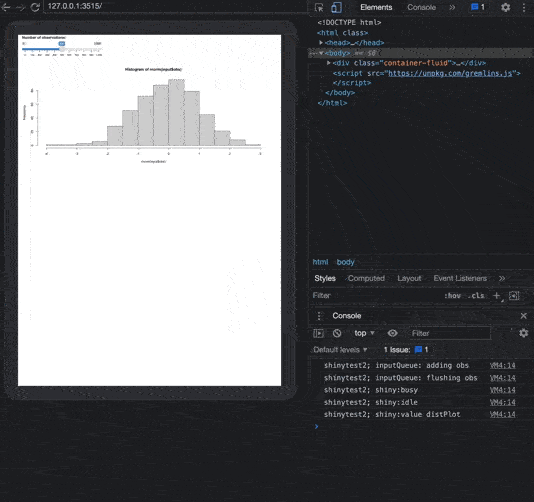

```{r, include = FALSE}
knitr::opts_chunk$set(
  collapse = TRUE,
  comment = "#>"
)
```

```{r setup}
library(shinytest2)
library(shiny)
```

# Monkey (headless) testing with `{shinytest2}`

Most people will use `{shinytest2}` with the plug and play `record_test()` app, which is very convenient if you are
not familiar with JavaScript. Under the hood, `record_test()` generates a R script composed of a series of 
instructions that manipulates the app to automate testing on CI/CD environments. 

Monkey testing is widely used by web developers to check the application robustness, particularly in apps with large
number of inputs. The goal is ultimately to try to break the app by triggering unexpected combinations. Most available libraries
are JS-based such as [gremlins.js](https://github.com/marmelab/gremlins.js), traditionally combined with JS-based global testing libraries like [Puppeteer](https://pptr.dev/), but can work with `{shinytest2}` as well. 

In this vignette, we'll provide a more thorough overview of the `AppDriver` R6 class (like for [`{shinytest}`](https://rstudio.github.io/shinytest/articles/in-depth.html)), which allows the developer
to programmatically control the app. We'll see how we can seemlessly benefit from gremlins.js with only few lines of code.

## Initialize the driver

We consider a simple app composed of a slider and a plot output:

```r
ui <- fluidPage(
  sliderInput("obs", "Number of observations:",
    min = 0, max = 1000, value = 500
  ),
  plotOutput("distPlot")
)

# Server logic
server <- function(input, output) {
  output$distPlot <- renderPlot({
    hist(rnorm(input$obs))
  })
}

# Complete app with UI and server components
shinyApp(ui, server)
```

The driver may be initialized with:

```r
headless_app <- AppDriver$new(
  app_dir = "<PATH_TO_APP>",
  name = "monkey-test",
  shiny_args = list(port = 3515)
)
```

Note the `shiny_args` slot allowing you to pass custom options to `shiny::runApp()` such as the port, which
might be useful if your organization restricts port number. `load_timeout` defaults to 10s and 20s locally and during CI/CD, respectively. 
Therefore, if your app takes longer to launch, you can change this value. Keep in mind that an app taking more than 20s to launch is generally
under-optimized and would require specific care such as profiling and refactoring. 

AppDriver starts a Chrome-based headless browser. Interestingly, if you need specific [flags](https://peter.sh/experiments/chromium-command-line-switches/) that are not
available by default in `{shinytest2}`, you can pass them before instantiating the driver:

```r
chromote::set_chrome_args(
  c(
    chromote::default_chrome_args(),
    # Custom flags: see https://peter.sh/experiments/chromium-command-line-switches/
)
```

Some flags are considered by default, particularly `--no-sandbox` which is apply only on CI/CD (Chrome won't start
without) such that you don't need to worry too much about this.

If you run this script locally, you may add `view = TRUE` to open the Chrome Devtools, which will significantly ease the testing calibration. I highly recommend to create the test protocol locally and then move to CI/CD later when all bugs are fixed. In the below figure, the application is shown on the left side panel. The top-right side panel shows the DOM elements (default) and the bottom-right side panel displays the JavaScript console output. 

```{r echo=FALSE, out.width='100%', fig.align='center'}

```

## Injecting gremlins.js

The next steps consists of injecting the gremlins.js dependency in the DOM so that we can unleash the horde.

### Easy way
The easiest way is to call:

```r
headless_app$run_js("
  let s = document.createElement('script');
  s.src = 'https://unpkg.com/gremlins.js';
  document.body.appendChild(s);
")
```

This creates a `<script>` tag pointing to the right CDN (content delivery network: optimized server to store libraries) and inserts
it at the end of the body.

To test whether everything worked well, we can dump the DOM, look for the scripts. We should be able to find
gremlins.js and try to call `typeof window.gremlins`, which should return an object:

```r
headless_app$get_html("script", outer_html = TRUE)
headless_app$get_js("typeof window.gremlins")
```

If `undefined` is returned instead, it means something went wrong. This is generally because the JS code
is blocked by the network. In this case, let's see what we can do in the next part.

```{r echo=FALSE, out.width='100%', fig.align='center'}

```


### Local way

If you work in a corporate environment chances are you'll end up in this situation. 
A solution is then to store and serve a local copy of the gremlin.js script with `shiny::addResourcePath()`.
Assuming `gremlins.js` are in `inst/js/gremlins.min.js`. Add this to the `app.R` file:

```r
addResourcePath("gremlins", "inst/js/gremlins.min.js")
```

We can subsequently inject the gremlins in the DOM and checks whether everything worked as expected:

```r
headless_app$run_js("
  let s = document.createElement('script');
  s.src = './gremlins/gremlins.min.js';
  document.body.appendChild(s);
")
plop$get_html("script", outer_html = TRUE)
plop$get_js("typeof window.gremlins")
```

## Unleash the horde

### A bit about gremlins.js

The workflow is rather simple:

  - We create the horde with `gremlins.createHorde()`.
  - We run the monkey test with `horde.unleash();`. 

```js
const horde = gremlins.createHorde();
horde.unleash();
```

`createHorde()` accepts many species of gremlins capable of handling various events such as
clicks, touch, form filling, scrolling, typing, ... described in the gremlins.js [documentation](https://github.com/marmelab/gremlins.js#advanced-usage).

As a side note, we don't recommend using the `scroller` which sometimes [crashes](https://github.com/rstudio/shinytest2/issues/117) the Chrome instance. 

If your plots rely on random elements like `rnorm`, it is best practice to setup a seed. 
By default, all species will attack in random order with a delay of 10 ms between each event. You can also control the attack strategy to fine tune the global behavior. Finally, if you want more control over what gremlins specie should be doing, you can define a custom specie. 


### Practice

#### Blind run

In the following, we run the most basic Monkey test configuration:

```r
headless_app$execute_js("gremlins.createHorde().unleash();")
```

Result is shown in the gif below. 

```{r echo=FALSE, out.width='100%', fig.align='center'}

```

#### Optimized testing

Does it really makes sense to invoke all species given we only have a slider? Absolutely not!
In the following code, we only want to test the slider input.

```{r echo=FALSE, out.width='100%', fig.align='center'}

```

The best specie to perform this task is the `toucher`, which is able to randomly move the slider input. The documentation specifies many events such as tap, doubletap, gesture and multitouch. It seems more relevant to apply only gesture, consisting of dragging the slider on the x-axis (note: gesture also consider the y-axis which does not make sense for the slider, which is an gremlins.js limitation. This however won't prevent our test from running). Also, we target the slider handle by its class `irs-handle single` to ensure we don't touch any other element and increase the number of maximum touch from 2 to 200. Not how precious is the HTML inspector, which allows to seamlessly inspect and extract any class or id. The __log__ parameter enables log in the JavaScript console:

```js
const customToucher = gremlins.species.toucher({
  // which touch event types will be triggered
  touchTypes: ['gesture'],
  // Touch only if element has class irs-handle single
  canTouch: (element) => element.className === 'irs-handle single',
  log: true,
  maxTouches: 200
});
```

We can create our custom horde and disable the FPS and Alert mogwais gremlins since they are not relevant to our case study:

```js
const horde = gremlins.createHorde({
  species: [customToucher],
  mogwais: [gremlins.mogwais.gizmo()]
});
```

As `unleash` is a __promise__, we can execute a function right after, to check whether the script ran as expected.

```js
horde
  .unleash()
  .then(() => {
    console.log('Gremlins test success')
});
```

If you are running on CI/CD and can't see the Chrome Devtools, you can still display the logs. The `console.log` output will be captured by the `{shinytest2}` logs with `headless_app$get_log()` allowing you to debug and refine the 
monkey testing script. 

```{r echo=FALSE, out.width='100%', fig.align='center'}

```


As Monkey testing lasts about 10s, you often want to take a screenshot of the ongoing attack:

```r
headless_app$execute_js(
  "const customToucher = gremlins.species.toucher({
    // which touch event types will be triggered
    touchTypes: ['gesture'],
    // Touch only if element has class irs-handle single
    canTouch: (element) => element.className === 'irs-handle single',
    log: true,
    maxTouches: 200
    });
    
    gremlins.createHorde({
      //randomizer: new gremlins.Chance(1234), // repeatable
      species: [customToucher],
      mogwais: [gremlins.mogwais.gizmo()]
    }).unleash().then(() => {
      console.log('Gremlins test success')
    });
  "
)

Sys.sleep(3)
headless_app$screenshot("gremlins.png")
```

```{r echo=FALSE, out.width='100%', fig.align='center'}

```


Should you run multiple attacks, it is always good practice to reset Shiny inputs between or even close the current headless app and restart a new session:

```r
headless_app$set_inputs(obs = 500)
```


If you run on CI/CD, don't forget to clean the session after tests are completed, particularly if you set the `shiny.port` option (you can't have 2 apps running on the same port):

```r
headless_app$stop()
```
